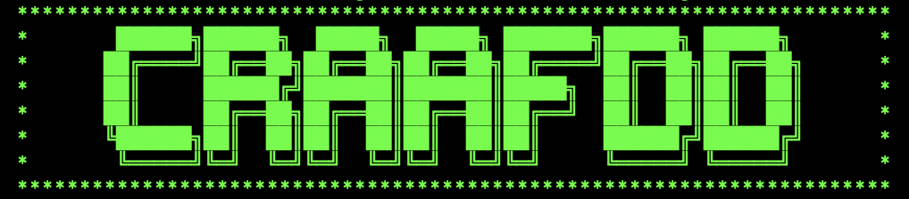
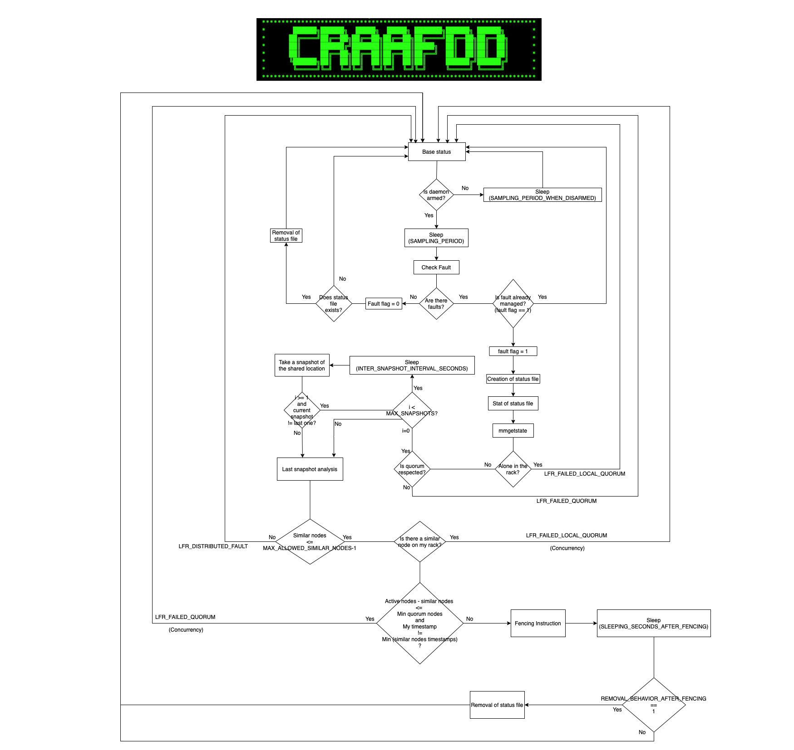

# craafdd

<h1><b>Critical Resources Auditing and context-Aware Fencing Decisions Daemon (CRAAFDD) v1.0</b></h1> 
Giuseppe Calò, <a href="mailto:giuseppe.calo@cmcc.it">giuseppe.calo@cmcc.it</a> 
Danilo Mazzarella, <a href="mailto:danilo.mazzarella@cmcc.it">danilo.mazzarella@cmcc.it</a> 
Marco Chiarelli, <a href="mailto:marco.chiarelli@cmcc.it">marco.chiarelli@cmcc.it</a> 
		      <a href="mailto:marco_chiarelli@yahoo.it">marco_chiarelli@yahoo.it</a> 

 
The daemon, written in ANSI C, constantly monitors the status of an audited network interface (which is a critical resource), necessary for the correct functioning of a distributed service, which is in this case the IBM’s GPFS Parallel File System. Whenever a fault on the audited resource is detected, the daemon starts a procedure called “Arbitration”, which consists in a series of progressive checks, needed to decide whether to perform a decision (called fencing instruction) or not. The decision consists in excluding the offended node on which the daemon is running on, from the distributed service whose correct and efficient functioning shall be preserved.  
The main purpose of the arbitration phase is to assure that the quorum condition shall always be respected. In particular, for ESS node types, at least the half plus one of the defined quorum nodes should always be in active status, whereas for CES node types, at least one node should always be in active status.  
Additionally, another arbitration aim is to filter, among all managed fault situations, only the sporadic ones, that do not compromise the distributed service status yet. In fact, Distributed Faults would compromise in any case the distributed service, and the release of the involved nodes would be useless. Thus, even though they are recognized and correctly managed, they’re not eligible for fencing.  
The daemon philosophy is to operate on all nodes which make up the distributed service in a peer- to-peer fashion. The other nodes situations, wherever they have to be known, are eventually captured with 0-byte status files located in a shared location defined in the <i>GPFS_CONTROL_PATH</i> variable (/data/.craafdd/ess or /data/.craafdd/ces, depending on the node type), thus avoiding TCP/IP connections or ARP broadcastings. The decisions are based on the captured context, following a pre-defined logic which is fixed for all the nodes (because the various daemons are instantiated on every node, but are compiled with exactly the same code).  
Several configuring options are available before the daemon startup. However, in the following, the general functioning with default options are considered for the sake of clarity. Tuning and customization arguments will be furtherly discussed later.  
The daemon, in an infinite loop, constantly checks, after a sleep of a quantity of seconds specified by the variable <i>SAMPLING_PERIOD</i>, the status of an audited network interface specified by the <i>AUDITED_NETWORK_INTERFACE</i> variable. If some faults occur, they are promptly recognized, and the Arbitration phase, if not already tried, takes place immediately.  
As the first action, the program creates a 0-byte status file in the shared location, thus already accessible for every other daemon instance running on other nodes. In this way, the node fault is visible to every other peer node, so they would take appropriate actions if they are at arbitration later stages.  
Then, the status file last modification time is taken, which will be later useful for further checks to assess the distributed or sporadic nature of the fault.  
Furthermore, the GPFS status is captured through the ‘<i>mmgetstate</i>’ command, whose absolute path is specified into the <i>GPFS_MMGETSTATE_COMMAND</i> variable. This step is mandatory in order to get some crucial information, such as the number of defined quorum nodes, active quorum nodes and min quorum nodes (the latter variable is dynamically read from the mmgetstate command output whether the <i>MIN_QUORUM_NODES</i> variable is set to -1, otherwise it is set to the value specified by the variable’s value). Eventually, if the physical/local quorum condition option is enabled (which will be furtherly discussed later in the configuration options paragraph), also the presence or absence of another node on the same rack will be assessed.  
At this point, the quorum condition is evaluated. If the active quorum nodes minus one is greater equal than the min quorum nodes, and, if the physical quorum condition option is enabled (if the <i>PHYSICAL_QUORUM_CONDITION</i> variable is set to 1), and at least one node on the same rack is active, then the arbitration phase continues. Otherwise, the arbitration phase fails and an error message is printed on the log (whose path is specified into the <i>FENCING_DAEMON_LOGFILE</i> variable), and an e-mail is sent, along with the mmgetstate command output and the arbitration elapsed time in seconds until that point, from the mail address specified into the <i>MAIL_FROM</i> variable to the mail address specified into the <i>MAIL_TO</i> variable, if both these variables are set. Note that, every time a fault occurs, but the arbitration phase does not reach the fencing instruction, then a signaling variable <i>fault_flag</i> is set (all these described statements will be true for all the error messages in the following). If the quorum test fails because the active quorum nodes minus one is lesser than the min quorum nodes, then the error ID is: “<i>Failed Quorum</i>”. On the other hand, if it fails because the physical quorum condition option is enabled, and there are no more active nodes on the same rack, then the error ID is: “<i>Failed Local Quorum</i>”.  
If the quorum condition is respected, then the Snapshot Test has to be performed, where the program checks that a rapidly changing concurrency situation is not occurring in the shared location. A Snapshot Test consists in the following block of instructions: the daemon sleeps of a quantity of seconds specified into the <i>INTER_SNAPSHOTS_INTERVAL_SECONDS</i> variable, then capture the content of the shared location, i.e. the name and the last modification timestamp of all the files actually existent in it at the moment of reading it. This block of instructions is repeated for a total of a number of times specified by the <i>MAX_SNAPSHOTS</i> variable. Note that this value should be greater equal to 1, otherwise no snapshots will be taken, and this leads to undefined behavior, because the program cannot check anymore for Distributed Faults or concurrency situations. If MAX_SNAPSHOTS is strictly greater than 1, than the program checks for the equality of two consecutive snapshots, i.e. the name and the timestamp of all the files in the shared location at time <i>t*INTER_SNAPSHOTS_INTERVAL_SECONDS</i> have to be equal to the name and the timestamp of all the files in the shared location presents in <i>(t-1)*INTER_SNAPSHOTS_INTERVAL_SECONDS</i>. If MAX_SNAPSHOTS is 1 or two consecutive snapshots are found to be equal, then the Arbitration phase continues. Otherwise, if MAX_SNAPSHOTS is strictly greater than 1, but no two consecutive snapshots have been found to be equal, then the arbitration phase fails, an error is printed on the log, and eventually an email is sent, along with the mmgetstate command output and the arbitration elapsed time in seconds until that point, with the aforementioned premises. In this case, the error ID is: “<i>Failed Snapshots Test</i>“. Consequently, the Distributed Fault check has to be performed. By referencing the last shared location snapshot taken from the previous phase, the timestamp of all the status files (except mine), is compared to the timestamp of mine. Then, if the number of status files that do not exceed my timestamp of a number of seconds specified into the <i>SNAPSHOT_TIMESTAMP_EPSILON</i> variable, are less or equal than a quantity specified by the <i>MAX_ALLOWED_SIMILAR_STAT_NODES</i> variable minus one, then the arbitration continues. Otherwise, an error is printed on the log, and eventually an email, along with the mmgetstate command output and the arbitration elapsed time in seconds until that point, is sent as before. The error ID is: “<i>Distributed Fault</i>”.  
At this point, the quorum condition, both local/physical and global/logical has to be retested with the nodes that are eventually trying to do the fencing themselves. If another node on the same rack is trying to be fencing, then no nodes including me are allowed to do fencing. Similarly, if doing the fencing on the current node and the other similar timestamp nodes will violate the logical quorum condition, then the current node will be allowed to do fencing if and only if its timestamp is less than the others’ timestamps. In these cases an error is printed on the log, an email is eventually sent, along with the mmgetstate command output and the arbitration elapsed time in seconds until that point, and the error IDs are respectively: “<i>Failed Local Quorum (concurrency)</i>” or “<i>Failed Quorum (concurrency)</i>”. If the previous tests are all passed, then the current node is finally allowed to execute the fencing instruction specified in the <i>FENCING_COMMAND</i> variable. On its completion, a success message is printed on the log and an e-mail is sent, along with the mmgetstate command output and the arbitration elapsed time, the fencing instruction elapsed time, and the total elapsed time, all three in seconds. Then, if the <i>SLEEPING_SECONDS_AFTER_FENCING</i> variable is greater than 0, the daemon sleeps that quantity in seconds. If the <i>REMOVAL_BEHAVIOR_AFTER_FENCING</i> variable is set to 1, after the previous slept time, the status file is removed. If any of the previously described errors occurs, if the <i>SLEEPING_SECONDS_AFTER_LFR_ERROR</i> variable is greater than 0, the daemon sleeps that quantity in seconds. If the <i>REMOVAL_BEHAVIOR_AFTER_LFR_ERROR</i> variable is set to 1, after the previous slept time, the status file is removed.  
When the arbitration phase finishes, both with success or errors, a signaling variable fault_flag is set to 1. It indicates that, since the fault has occurred, an arbitration phase has already been tried, so the fault has already been managed. While this variable is 1, and the fault is still present, the daemon will not re-enter the Fault Management System (F.M.S., an alias for the arbitration phase) anymore. Its value will be set to 0 if and only if the fault is no longer recognized. In this case, the existence of the current node’s status file will be checked and, eventually, it will be removed in order to notify that the node is no longer exhibiting a faulting status.  
Whenever an error occurs in the arbitration phase, the default program behavior is to set fault_flag to 1 and continue the infinite loop in order to constantly check for a new fault. However, this behavior may be changed by setting the <i>LFR_ERROR_STATEMENT</i> variable to 0, thus causing the program to terminate.  
If the arbitration phase fails for any reason but the fault is still present, one might want the daemon to re-execute the Arbitration phase, because in the meanwhile the distributed context could have become favorable, thus making the current node eligible for fencing. This may be attained by entering the node and by launching the script <i>./craafdd_ffms.sh</i>, located in the daemon current working directory.  
The daemon could be armed/disarmed whenever required. The script <i>./craafdd_rearm.sh</i>, located in the daemon current working directory, toggles the daemon state into the opposite state. For example, if it is armed, the script will disarm it, thus putting it into sleeping mode, and vice versa if it is disarmed, a subsequent script launching will rearm it. For each cycle, it will sleep a quantity of seconds specified by the <i>SAMPLING_PERIOD_WHEN_DISARMED</i> variable. When disarmed, the daemon does not do any fault checking, and obviously cannot enter the Fault Management System.  
In order to gently kill the daemon, the script <i>./craafdd_kill.sh</i>, located in the current working directory, should be launched. This will allow the correct closing of the UDP socket (previously opened for monitoring the audited network interface), the print of a success message on the log with the daemon execution Total Elapsed Time in seconds, along with the subsequent correct closing of the log file descriptor.  
The configuration options listed in the <i>./craafdd_launcher.sh</i> (or <i>./craafdd_launcher_EMS.sh</i>, <i>./craafdd_launcher_ESS.sh</i>, <i>./craafdd_launcher_CES.sh</i>) are passed as arguments to the craafdd executable before its execution. The main ones have already been explained in the previous tractation. This has the advantage of not recompiling the program each time an option needs to be changed. However, when this is the case, the daemon has to be restarted.  
The options starting with <i>MMGETSTATE_ prefix</i> are GPFS’ mmgetstate command dependent, thus must not be changed, and introduced only for the aforementioned command eventual versions changings.  
The option <i>AM_I_QUORUM</i> must be set to 1 if the daemon is started on a quorum node, and 0 otherwise, because a different parsing has to be done on the mmgetstate command in order to obtain the number of defined quorum nodes, active quorum nodes and min quorum nodes.   

<h4>USEFUL INFORMATION:</h4>
<ul>
<li>Start the daemon 
<i>./craafdd_launcher.sh</i> 
<i>./craafdd_launcher_EMS.sh</i> 
<i>./craafdd_launcher_ESS.sh</i> 
<i>./craafdd_launcher_CES.sh</i> 
<li>Start the program (as a daemon) 
<i>systemctl start craafdd</i>
<li>Distribute programs starting (as a daemon) 
<i>mmdsh -N 1-9 "systemctl start craafdd"</i>
<li>Distributed daemons status: 
<i>mmdsh -N 1-9 "systemctl status craafdd"</i>
<li>ARM/REARM the daemon: 
<i>./craafdd_rearm.sh</i>
<li>Force Fault Management System: 
<i>./craafdd_ffms.sh</i>
<li>Gently kill the daemon: 
<i>./craafdd_kill.sh</i>
<li>Current working directory: 
<i>/var/local/craafdd/</i>
<li>Shared location directories: 
<i>/data/.craafdd/</i> 
<i>/data/.craafdd/ces</i> 
<i>/data/.craafdd/ess</i> 
<li>Distributed ARM/REARM the daemons: 
<i>mmdsh -N 1-9 "cd /var/local/craafdd; ./craafdd_rearm.sh"</i>
<li>Distributed Fault Management System Forcing: 
<i>mmdsh -N 1-9 "cd /var/local/craafdd; ./craafdd_ffms.sh"</i>
<li>Distributed Gently kill: 
<i>mmdsh -N 1-9 "cd /var/local/craafdd; ./craafdd_kill.sh"</i>
<li>Distributed daemons stop: 
<i>mmdsh -N 1-9 "systemctl stop craafdd"</i>
<li>Code path: 
<i>/root/craafdd_new/</i>
<li>Compilation with GCC: 
<i>gcc craafdd.c -o craafdd</i>
<li>Distributed compilation: 
<i>mmdsh -N 1-9 “cd /var/local/craafdd; gcc craafdd.c -o craafdd"</i>
<li>Distributed Log files print: 
<i>mmdsh -N 1-9 "cd /var/local/craafdd; cat craafdd_log.txt</i>
<li>Distributed Log files removing: 
<i>mmdsh -N 1-9 "cd /var/local/craafdd; rm craafdd_log.txt"</i>

In the following the CRAAFDD flowchart is presented:

